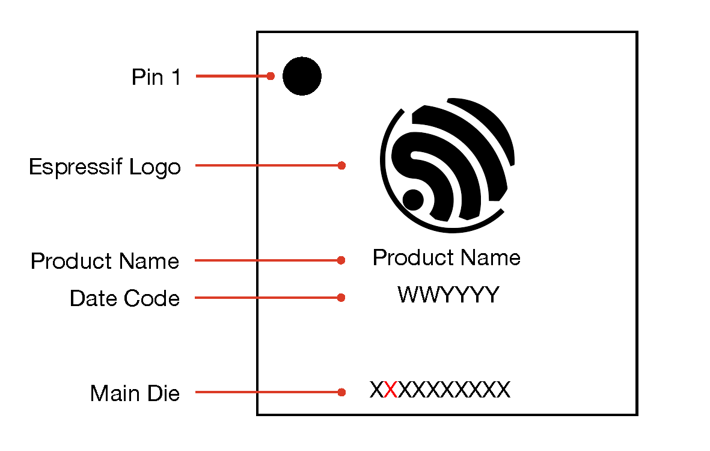

芯片功能对比
============

:link_to_translation:`en:[English]`

.. raw:: html

   

--------------

请从编程开发⽅式、性能表现、功耗表现等⽅⾯列举⼀下 ESP32 单核与双核的区别？
------------------------------------------------------------------------------------------------------

  ESP32 单核与双核的主要差异是双核多了⼀个独⽴核⼼，可以把⼀些实时性⾼的操作放在该独⽴核⼼上。

  - 单核与双核的编程⽅式⼀致，不过单核芯片需要配置 FreeRTOS 运⾏在单核上，双核芯片则无需此步骤。配置路径：``make menuconfig`` > ``Component config`` > ``FreeRTOS`` > ``[*] Run FreeRTOS only on first core``。
  - 性能表现仅在⾼负载运算时有差异（例如 AI 算法，⾼实时性中断），其余使⽤上⽆明显差异。
  - 功耗仅在 Modem-sleep 模式下会有细微差别，此时双核芯片的功耗略高于单核芯片。详情可参考 `《ESP32 技术参考手册》 <https://www.espressif.com/sites/default/files/documentation/esp32_technical_reference_manual_cn.pdf>`_。

--------------

ESP32 芯片版本 v3.0 在软硬件使⽤上和之前版本的芯片有什么区别呢？
------------------------------------------------------------------------

  - 软件上使⽤⽆区别，是兼容之前的固件的，硬件上修复了⼀些 bug。
  - 具体的设计变化可以参考⽂档 `《ESP32 芯片版本 v3.0 使用指南》 <https://www.espressif.com/sites/default/files/documentation/esp32_chip_revision_v3_0_user_guide_cn.pdf>`_。

--------------

ESP32 的 GPIO34 ~ GPIO39 管脚是否只能设置为输入模式？
-----------------------------------------------------

  - ESP32 的 GPIO34 ~ GPIO39 只能设置为输入模式，没有软件上拉或下拉功能，不能设置为输出模式。
  - 详情可参见 `外设说明 <https://docs.espressif.com/projects/esp-idf/zh_CN/latest/esp32/api-reference/peripherals/gpio.html?highlight=gpio34#gpio-rtc-gpio>`_。

--------------

ESP32 有适配 Linux 平台驱动吗？
-------------------------------

  可以使用 `esp-hosted <https://github.com/espressif/esp-hosted>`__ 方案。该方案目前提供三种主要变体： **ESP-Hosted-NG**、 **ESP-Hosted-FG** 和 **ESP-Hosted-MCU** 。各变体的区别详见 `变体比较 <https://github.com/espressif/esp-hosted#-variant-comparison>`__。

  - **ESP-Hosted-NG** 与 **ESP-Hosted-FG** 均支持 Linux 主机：

    - **ESP-Hosted-NG** 提供标准的 802.11 Wi-Fi 接口，支持 STA 和 SoftAP 模式。
    - **ESP-Hosted-FG** 提供 802.3 Ethernet 接口，支持 STA、SoftAP 以及 STA+SoftAP 模式。
  - 若使用 **ESP-Hosted-FG** 且目标 Linux 平台尚未适配，可参考 `ESP-Hosted-FG 移植指南 <https://github.com/espressif/esp-hosted/blob/master/esp_hosted_fg/docs/Linux_based_host/porting_guide.md#porting-guide>`__ 进行移植。
  - 若使用 **ESP-Hosted-NG** 且目标 Linux 平台尚未适配，可参考 `ESP-Hosted-NG 移植指南 <https://github.com/espressif/esp-hosted/blob/master/esp_hosted_ng/docs/porting_guide.md>`__ 进行移植。

--------------

模组屏蔽盖上的二维码扫描数据如何解读？
--------------------------------------------

  - 若二维码扫描后读取数据为 0920118CAAB5D2B7B4，那么其中 09 为工厂代码，20 为 20** 生产年份（本示例中为 2020 年），11 为本年第几周生产，后 12 位 8CAAB5D2B7B4 为设备 MAC 地址。关于此信息的最新说明，请参考 `《模组包装信息》 <https://www.espressif.com/sites/default/files/documentation/espressif_module_packaging_information_cn.pdf>`_。

--------------

ESP32 的 VDD3P3_RTC 是否支持单独电池供电？
------------------------------------------------------

  - ESP32 内部 RTC 域不可以独立工作，需要主 CPU 参与配置，单独使用电池供电时依然无法抵御突然掉电的情况。
  - 如果需要系统掉电时时钟信息保存，可以添加外部 RTC 时钟芯片。

--------------

ESP32-PICO-D4 和 ESP32-PICO-V3 以及 ESP32-PICO-V3-02 有什么区别？
-----------------------------------------------------------------------

  - 内置芯片版本：ESP32-PICO-V3 和 ESP32-PICO-V3-02 的核心是 ESP32 (ECO V3) 芯片， ESP32-PICO-D4 的核心是 ESP32 (ECO V1) 芯片。
  - 封装尺寸：ESP32-PICO-D4 和 ESP32-PICO-V3 的尺寸为 7 × 7 × 0.94 (mm)，ESP32-PICO-V3-02 的尺寸为 7 × 7 × 1.11 (mm)。
  - 内置 flash：ESP32-PICO-D4 和 ESP32-PICO-V3 集成了 4 MB 的 SPI Flash，而 ESP32-PICO-V3-02 集成了 8 MB flash 和 2 MB PSRAM。
  - 管脚差异：可以参考 `《ESP32­-PICO-­V3-­02 技术规格书》 <https://www.espressif.com/sites/default/files/documentation/esp32-pico-v3-02_datasheet_cn.pdf>`_ 中的“与 ESP32-PICO­-V3 和 ESP32-­PICO-­D4 兼容性”章节。

---------------

ESP8266 是否支持 32 MHz 晶振频率？
--------------------------------------------------------------------------------------------------------------------------------

  - 不支持，ESP8266 支持 26 MHz 和 40 MHz 晶振频率，推荐用 26 MHz。

---------------

ESP 系列产品是否支持 Zephyr？
-----------------------------------------------------------------------------------------------------------------------------------------

  - ESP 系列产品对 Zephyr 的支持可以参考 `乐鑫对 Zephyr 的最新支持 <https://www.espressif.com/zh-hans/news/Zephyr_updates>`_，目前仅适配了部分功能模块，后续会进一步更新。如果您有相关的功能需求，可以先在 `Zephyr Github issue <https://github.com/zephyrproject-rtos/zephyr/issues/29394>`_ 上查询或者提问。
  - 也可以从 `Zephyr 官方文档 <https://docs.zephyrproject.org/latest/introduction/index.html>`_ 的 `XTENSA Boards <https://docs.zephyrproject.org/latest/boards/xtensa/index.html>`_ 和 `RISCV Boards <https://docs.zephyrproject.org/latest/boards/riscv/index.html>`_ 找到 ESP 产品的相关资料。

---------------

如何通过芯片丝印，识别芯片版本？
-------------------------------------------------------------------

芯片版本可通过查看芯片丝印最下方 Espressif Tracking Information 行的第二位进行识别。

- 有关不同芯片版本的详细差异，请从乐鑫 `文档页面 <https://www.espressif.com/zh-hans/support/documents/technical-documents?keys=%E5%8B%98%E8%AF%AF%E8%A1%A8>`_ 查看对应芯片系列的勘误表文档。
- 有关芯片丝印的完整介绍，请参考 `《乐鑫芯片包装信息》 <https://www.espressif.com/sites/default/files/documentation/espressif_chip_packaging_information_cn.pdf>`_。
